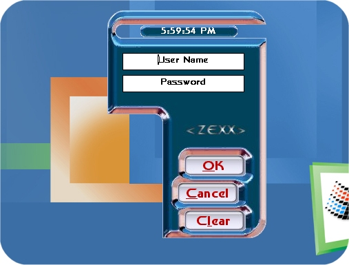



## Pixel Manipulation

### Description

Ever wanted to make a cool shaped form....well....this code is for you. Just look at the screenshot. Oh and, don't feel obligated to vote!Thanx yall!(inspired by previous PSC entries.)
 
### More Info
 

             |
---                |---
**Submitted On**   |2001-09-27 17:57:20
**By**             |[\< ZEXX \>](https://github.com/Planet-Source-Code/PSCIndex/blob/master/ByAuthor/zexx.md)
**Level**          |Advanced
**User Rating**    |4.9 (39 globes from 8 users)
**Compatibility**  |VB 6\.0
**Category**       |[Custom Controls/ Forms/  Menus](https://github.com/Planet-Source-Code/PSCIndex/blob/master/ByCategory/custom-controls-forms-menus__1-4.md)
**World**          |[Visual Basic](https://github.com/Planet-Source-Code/PSCIndex/blob/master/ByWorld/visual-basic.md)
**Archive File**   |[Pixel Mani270709272001\.zip](https://github.com/Planet-Source-Code/zexx-pixel-manipulation__1-27597/archive/master.zip)

